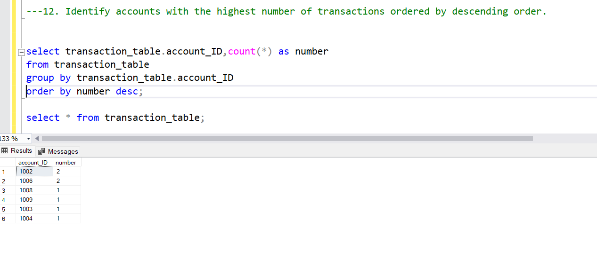

# creating customers table

create table customers
(
customer_ID integer Primary key,
first_name varchar(20),
last_name varchar(20),
DOB date,
Email varchar(30),
phno varchar(20),
address varchar(30)
);

# creating accounts table

create table accounts
(
account_ID integer primary key,
customer_ID integer foreign key references customers(customer_ID),
account_type varchar(20),
balance decimal
);

# transaction_table

create table transaction_table
(
transaction_ID integer primary key,
account_ID integer foreign key references accounts(account_ID),
transaction_Type varchar(20),
amount decimal,
transaction_date Date
);

# creating intrests_rate table

create table intrest
(
Intrest_rate_ID integer primary key,
account_type varchar(20),
intrest_rate decimal
);

# creating branches table

create table branches
(
Branch_ID integer primary key,
Branch_name varchar(20),
address varchar(30)
);

1. Insert at least 10 sample records into each of the following tables: `Customers`, `Accounts`, `Transactions`, `InterestRates`, `Branches`.

```sql

insert into customers(customer_ID,first_name,last_name,DOB,Email,phno,address)VALUES
(1,'Ashritha','Mopuri','1995-06-12','ashi@gmail.com','123456789','kkd');

insert into customers(customer_ID,first_name,last_name,DOB,Email,phno,address)VALUES
(2,'Latha','Palika','1996-01-21','latha@gmail.com','234567890','kkd');

insert into customers(customer_ID,first_name,last_name,DOB,Email,phno,address)VALUES
(3,'surekha','sabbarapu','1993-11-16','sur@gamil.com','345678912','kkd');

insert into customers(customer_ID,first_name,last_name,DOB,Email,phno,address)VALUES
(4,'neelu','jugtada','2000-05-16','neelu@gmail.com','987654321','RJY');

insert into customers(customer_ID,first_name,last_name,DOB,Email,phno,address)VALUES
(5,'chandu','karri','2002-01-21','chandu@gmail.com','8790132345','HYD'),
(6,'venu','sri','2002-04-30','venu@gmail.com','768901241','chennai'),
(7,'john','smith','2002-01-12','john@gmail.com','765390123','Banglore'),
(8,'renu','john','1989-05-21','renu@gmail.com','965480123','london'),
(9,'rashida','begum','2003-04-27','rashi@gmail.com','765890432','Paris'),
(10,'vijaya','yalla','2001-04-16','vijaya@gmail.com','955365915','Rome');


select * from customers;
```


```sql

insert into accounts(account_ID,customer_ID,account_type,balance)values
(1001,1,'savings',80000),
(1002,2,'current',56000),
(1003,3,'zero-balance',50000),
(1004,4,'current',25000),
(1005,5,'current',12000),
(1006,6,'savings',40000),
(1007,7,'savings',45000),
(1008,8,'zero-balance',100000),
(1009,9,'zero-balance',20000),
(1010,10,'savings',22000);

select * from accounts;


```

```sql

insert into transactions(transaction_ID,account_ID,transaction_Type,amount,transaction_date)values
(201,1001,'deposit',20000,'2023-01-12'),
(202,1002,'withdrawal',10000,'2021-06-21'),
(203,1003,'transfer',30000,'2002-05-16'),
(204,1004,'deposit',20000,'2021-04-23'),
(205,1005,'deposit',10000,'2022-11-27'),
(206,1006,'withdrawal',30000,'2012-12-2'),
(207,1007,'deposit',50000,'2011-06-07'),
(208,1008,'transfer',2000,'2021-05-13'),
(209,1009,'transfer',4000,'2020-03-18'),
(210,1010,'withdrawal',2000,'2021-10-07');

select * from transactions;


drop table transactions;


insert into transaction_table(transaction_ID,account_ID,transaction_Type,amount,transaction_date)values
(1,1001,'deposit',20000,'2023-01-12'),
(2,1002,'withdrawal',10000,'2021-06-21'),
(3,1003,'transfer',30000,'2002-05-16'),
(4,1004,'deposit',20000,'2021-04-23'),
(5,1005,'deposit',10000,'2022-11-27'),
(6,1006,'withdrawal',30000,'2012-12-2'),
(7,1007,'deposit',50000,'2011-06-07'),
(8,1008,'transfer',2000,'2021-05-13'),
(9,1009,'transfer',4000,'2020-03-18'),
(10,1010,'withdrawal',2000,'2021-10-07');

```

```sql

insert into intrest(Intrest_rate_ID,account_type,intrest_rate)values
(1,'savings',2.0),
(2,'current',1.5),
(3,'savings',1.0),
(4,'savings',1.25),
(5,'current',2.0),
(6,'current',2.25),
(7,'savings',1.07),
(8,'savings',1.12),
(9,'current',1.10),
(10,'current',1.12);

select * from intrest;


```

```sql
insert into branches(Branch_ID,Branch_name,address)values
(1,'Main Branch','KKD'),
(2,'Down Branch','HYD'),
(3,'Up Branch','chennai'),
(4,'Down Branch','Delhi'),
(5,'East Branch','London'),
(6,'West Branch','USA'),
(7,'North Branch','Europe'),
(8,'South Branch','Mumbai'),
(9,'Temple Branch','Jk'),
(10,'Banugudi Branch','KKD');

select * from branches;


```

2.  Write a SQL query to retrieve the name, account type, and email of all customers.

```sql

select (customers.first_name+' '+customers.last_name)
as
Name,accounts.account_type,customers.Email
from customers inner join accounts
on customers.customer_ID=accounts.customer_ID;

```


3. Write a SQL query to list all transactions along with the corresponding customer.

```sql
select (customers.first_name+' '+customers.last_name)
as
Name,transaction_table.transaction_ID,transaction_table.transaction_Type,transaction_table.transaction_date
from transaction_table inner join customers
on customers.customer_ID=transaction_table.transaction_ID;

```


4. Write a SQL query to increase the balance of a specific account by a certain amount.

```sql

update  accounts set balance=balance+120000 where accounts.account_ID='1002'

select * from accounts;

.png>)

```

5. Write a SQL query to combine the first and last names of customers as `full_name`.

```sql

select (customers.first_name + ' '+ customers.last_name) as FullName from customers


```

6. Write a SQL query to remove accounts with a balance of zero where the account type is savings.

```sql

delete from transaction_table where transaction_table.amount='0'

delete from accounts where accounts.account_type='savings' and accounts.balance='0';

select * from accounts;


```

7. Write a SQL query to find customers living in a specific city.

```sql

select (customers.first_name+' '+ customers.last_name) as name ,count(customers.address)
as number, customers.address from customers
where customers.address='kkd'
group by customers.address,(customers.first_name+' '+customers.last_name);


```

8. Write a SQL query to get the account balance for a specific account.

```sql

select accounts.balance
from accounts
where accounts.account_ID='1005'


.png>)
```

9. Write a SQL query to calculate the interest accrued on savings accounts based on a given interest rate.

```sql

select * from accounts;
select * from intrest;

select (accounts.balance*(intrest.intrest_rate/100))
as intrest
from accounts inner join intrest
on accounts.account_type=intrest.account_type
where accounts.account_type='savings';


```

10. Write a SQL query to find the average account balance for all customers.

```sql

select * from customers;

select * from accounts;

select (customers.first_name+ ' '+customers.last_name) as Name,
avg(accounts.balance)
from customers inner join accounts
on customers.customer_ID=accounts.customer_ID
group by customers.first_name,customers.last_name, accounts.balance;


```

11. Write a SQL query to calculate the average daily balance for each account over a specified period.

```sql

use Bank;

select * from accounts;
select * from transaction_table;
select * from customers;
select * from intrest;


select avg(transaction_table.amount)
from transaction_table
where transaction_date
between '2021-05-13' and '2022-05-13';

.png>)

```

12. Identify accounts with the highest number of transactions ordered by descending order.

```sql

select transaction_table.account_ID,count(*) as number
from transaction_table
group by transaction_table.account_ID
order by number desc;

select * from transaction_table;



```

13. List customers with high aggregate account balances, along with their account types.

```sql

select customers.first_name,customers.last_name,sum(accounts.balance),accounts.account_type
from customers inner join accounts
on customers.customer_ID=accounts.customer_ID
group by customers.first_name,customers.last_name,accounts.balance,account_type;


```

14. Identify and list duplicate transactions based on transaction amount, date, and account.

```sql

select account_ID,amount,transaction_date,count(*)
from transaction_table
group by account_ID,amount,transaction_date
having COUNT(*)>1;


```

15. Calculate the total balance for each account type, including a subquery within the SELECT clause.

```sql

select * from accounts;

select account_type,
(select sum(balance)
from accounts
where account_type=a.account_type)
as total_balance
from
(
select
distinct account_type
from accounts
)
as a;


.png>)

```
