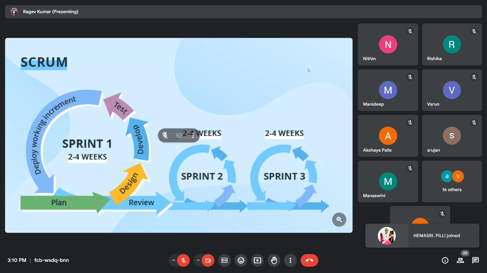

# Intro

1. FE
   - hii

```css
.hi {
  object-fit: cover;
  width: 100vw;
  height: 300px;
  object-fit: cover;
}
```

# Intro to JavaScript:

Declaraing the variable:  
 var x=10  
Finding the type of variable:  
 typeOf(x)

```Js
var student = {
  name:"ashi"
  age:20
  company:"proclink"
}

typeOf(name)=> typeOf(student.name)

```

data type of array : 'object'[beacause of key value pair]  
typeOf(Infinty): 'number'  
typeOf(-Infinty): 'number'

when u declare the variable but when u don't give the value then we get undefined

Undefined is a type and it's value is also undifined  
typeOf(null): 'object'

The js code is written within the <script></script>  
It must be written before </body>

# Types of variable declarations:

1. var :  
   Reassign and redeclare is possible,
2. let:  
   reassign is possible and redeclare is not possible ,
3. const:  
    reassign and redeclare not possible.
   we can't change the address but we can change the value.

# Datatypes:

string,number,null,boolean,object,undefined

# scope in JS:

Lifetime of the variable.

```JS

<body>
    <script>
        {
            var x1=10;
            let x2=20;
        }

        console.log(x1);
        console.log(x2);
    </script>

</body>

```

In the above code, let cannot be accessed because it cannot be updated outside the block.

Undefined: value(when we does not assign an value)
not defined: error

````Js

function fun(){
  var t1=10;
  let t2=20;
}

console.log(t1)
console.log(t2)

'''


```Js


function drivingTest(age){
  if(age>18){
  let msg="elligible";
  }
else{
  let msg="not elligible";
}
console.log("men are" + msg);
}
drivingTest(20);

```
````

# Typecasting/coercion:

```js
var x1 = 3;
var x2 = "5";
console.log(X1 + x2); //35
console.log(x1 - x2); //-2
```

Js automatically perform implicity conversion.

## Explicit Coercion:

console.log(x1 + parseInt(x2));
cosole.log(x1 + +x2);

## Implicit Coercion:

var x1 = 3;
var x2 = "5";
console.log(x1 + x2);
console.log(x1 - x2);

Array-> string:

[2,4,5] + "abc" //"2,4,5abc"

.toString():converts int to string.

null + 5 // 5

4 \* "5a" // NAN(not a number)

typeOf(NAN) // number

NAN / 4 , NAN \* 3 // NAN

# Which is faster?

== or === -> ===

== -> allows typecasting.
===-> does not allow typecasting.

# inline: witing code in same page

# exline: writing code in new file and reference it using src within <script src="path name"> </script>

# Types Of Functions:

1. Normal Function:
   function call, function declaration, function body

// n->parameter
// argument->10

function double(n){
return n \* 2;
}
console.log(double(10));

after return keyword the statements written will not be executed.

2 ways to exit path:

       put the return keyword
       exists at the last line of the body

2. Arrow Function:

const double = (n) => {
return n \* 2;
};

                or

const double = (n) => n \* 2;

# why do we create a function:

change in one place it's gets reflected everywhere.

# 5 pillars of code quality:

1. Readability -> 75%
2. Maintainability -> code debt
3. Extensibility
4. Testability
5. Performance

# Copy By Value:

var q1=[100,200]
var q3 = [...q1]; //spread (copy by value)

... -> spread operators

// merging the arrays:

var t1=[400,500];
var t2=[90,80];
var t3=[...t2,...t1];
console.log(t3)

o/p -> [90,80,400,500]

# Different for loops:

```js

1. for loop:

// more control

const marks = [80,90,100];
for(let i=0;i<marks.length>;i++){
  console.log("index:",i,"mark",marks[i]);
}

2. for in loop:

if you want index

//readable and simple

for(let idx in marks){
  console.log("index:",idx,"marks",marks[idx];)
}

3. for of loop:

if you don't want index i.e., uses of elements.

//readable and cleaner


for(let mark of marks){
  console.log("mark:",mark);
}


```

#ES6 featues:

1. let & const
2. ``Template literal
3. ...Spread Operator
4. ...Rest operator
5. Destructuring
6. class
7. Arrow Function

# Object methods:

```js

let salaries = {
john:100,
abhi:200,
};

Object.keys(salaries):To access names //john,abhi
Object.values(salaries):To access salary //100,200
```

# Template literal:

function fullname(fn,ln){
return 'welcome ${ln}, ${fn} !!!';
}
fullname("abc","def")

# feactures:

1. uses interpolations
2. suports multi line strings

# REfactoring:

making the quality better with same functionality.

# Array destructuring: uses index

const [t1, t2,t3] = [100,200]; //t3=undefined
console.log(t1,t2,t3);

```js
default value is taken only if t3 is undefined

const[t1,t2,t3=80]=[100,200,300];         t1=100 t2=200
console.log(t1,t2,t3);                  //t3=300

const [t1, ,t2,t3=80]=[100,200,null];
console.log(t1,t2,t3);                  //100 null 80

```

# Object destructuring:uses keys

it matches with key names(names of the attributes).

```js

const {name,skill}={
  name='abc'                     //undefined
}
console.log(skill)


if the default is given it will print undefined only

const {name,skill='genius'}={
  name='abc'                     //genius
}
console.log(skill)

```

# ES6 feactures:

comma(,) is replaced by \_

# Binaray operator

1. Arithmetic +,-,\*,/
2. Logical &&,||
3. Relational >,<,==,===

# unary Operator:

++, --

# Ternary Operator:

'''js
?,:

# Truthy vs Falsy:

"if" value converts into true the truth

let x = "cool";

if(x) {
console.log("hey");
} else{
cosole.log("nope")
}

# STRING METHODS:

.toUpperCase()
.toLowerCase()

converting string to array:

"hi hello"
"hi hello".split(" ") =>['hi','hello']

converting array to hello:

.join(" |") => 'hi|hello'

for splitting for every character =>.split('')
.reverse():it is only performed upon arrays only.
.slice()
.push()

\*\*\*\***\*\*\*\***\***\*\*\*\***\*\*\*\***\*\*\*\***SDLC\***\*\*\*\*\***\*\*\*\*\***\*\*\*\*\***\*\*\***\*\*\*\*\***

# SDLC(S/w Development Life Cycle):

1. Planning : planning the idea
2. Analysis : Business and Techincal
3. Design : Figma, Adobe xd,Sketch
   features:variant,autolayout
4. Implementation
5. Testing and integration
6. Maintenanace:requesting for small features which need to be added.

STAKEHOLDERS:  
people who are responsible if anything goes wrong in the product(office point of view).  
people who are taking risk.

# 6 Phases Of the SDLC:

1. ANALYSIS:

   1. Product Owner
   2. Project Manager
   3. Business Analyst
   4. CTO

2. DESIGN:  
   1.System Architect : set up blueprint of the project.  
   2.UX/UI designer

3. DEVEPLOMENT:

   1. Front-end DEveplopment
   2. Back end Deveploment

4. Testing:

   1. Solution Architect
   2. QA Engineer
   3. Tester
   4. DEvops

5. Deployment:

   1. Data Administrator
   2. Devops

6. Maintenance:
   1. users
   2. testers
   3. support managers

# Product based and Service based companies:

# Waterfall vs Agile:

.png>)

Waterfall model examples:

1. Metro building,civil projects,automobilies,migration projects only.
2. (6 months time)
3. 2 releases in a year.

Agile model examples:

1. It is a cyclic process.
2. 12 releases in a year.

# Implementation of Agile process:

The project is divided into equal parts-> scrum.



sprint retrospective will happens for an hour.
story point means how much time you are giving to complete the work.

# SCRUM: implementation of agile process

# KANBANN BOARD:

.png>)

# Burn down chart:


.png>)

# CODING STANDARDS:

1. variable names and function names should be in camel case.
2. camel case and pascal case.
